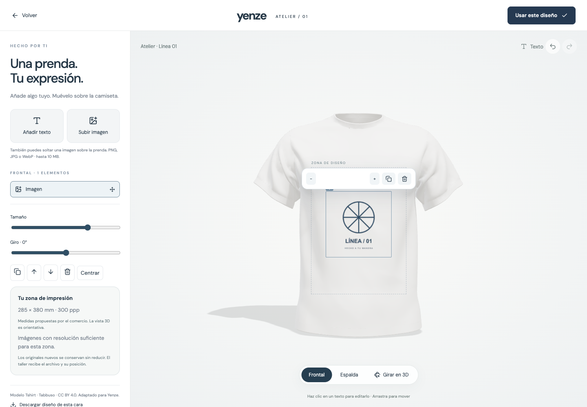

# Yenze Studio

[Live demo](https://yenze-studio-open-beta.vercel.app) · [Download beta](https://github.com/Josusanz/yenze-studio/releases)

**Make it theirs. Keep it yours.**

An open-source product configurator builder for 2D images, layered artwork, GLB models and services that need no images at all. Build choices, show a live preview, collect requests and keep the exact configuration attached to each order.

**Open beta · AGPL-3.0-only · Self-hosted**

[Get started](#quick-start) · [Documentation](docs/README.es.md) · [Roadmap](ROADMAP.md) · [Report a problem](https://github.com/Josusanz/yenze-studio/issues/new/choose) · [Contribute](CONTRIBUTING.md)



## Start with a real use case

- **Custom apparel:** front/back text and image placement, a licensed starter shirt model, private original uploads, resolution guidance and customer proof approval.
- **Visual products:** complete photos, transparent layers, imported GLB materials or a scene built from primitive shapes.
- **Services:** a guided selection and quote experience with no photos or 3D assets required.

The first two focused onboarding recipes are apparel and services. Twelve sector presets provide editable questions, not twelve completed industry integrations.

## Quick start

Requires Node.js 24+ and npm. No external service is required to create and publish a local quote-based configurator.

```sh
git clone https://github.com/Josusanz/yenze-studio.git
cd yenze-studio
npm ci
cp .env.example .env
npm run dev
```

Open **http://localhost:3060**. Create an account with a business name, choose **Crear configurador**, define the customer's choices and publish a quote-based example. The landing supports English and Spanish; the current editor UI is Spanish. There are no default passwords or preloaded customer accounts.

Data and uploaded assets are stored in `data/studio.sqlite`. Keep this directory private and persistent. Never commit it.

## What is included

| Area | Implemented |
| --- | --- |
| Builder | Guided creation, draft recovery in the wizard, nested choices, prices, dependency/exclusion rules, preview, undo/redo |
| Rendering | Image variants, layered 2D, self-contained GLB, primitive 3D scenes |
| Apparel | Direct text/image manipulation, original preservation, physical print area, 150/300 DPI PNG exports for merchants |
| Operations | Workspaces, customers, saved configurations, quotes, order snapshots, proof approvals, messages |
| Integration | Embed iframe/SDK, server-priced expiring cart tickets, scoped API tokens, MCP stdio |
| Optional providers | Stripe Connect, Resend verification/reset email, Meshy photo-to-3D |
| Recovery | Online SQLite backup, integrity checks, restore into a new directory |

## What the beta does not promise

This is not an audited enterprise service, a universal CAD/manufacturing engine or a zero-maintenance hosted SaaS. PNG exports are not PDF/X, CMYK separations or cutting patterns. The included shirt does not automatically discover print zones on arbitrary models.

WooCommerce has an **experimental, opt-in adapter** requiring staging validation. Wix, Squarespace and Framer can embed the experience; their native carts are not implemented. External order synchronization, hosted subscription billing, additional currencies and horizontal scaling remain roadmap work. Payments and email require your own configured providers and deployment checks.

## Development and checks

```sh
npm run build
npm test
npx playwright install chromium
npm run test:e2e
```

Browser tests use isolated temporary databases. `npm run build:showcase` creates a **static landing/demo only** in `dist-showcase`; it contains no account, ordering or backend service. `npm run build` creates the full application's UI in `dist`.

## Deploy the full application

Use one Node process with persistent storage, behind HTTPS. The application is not designed for ephemeral serverless SQLite storage. See [deployment](deploy/README.md) and [operations](docs/OPERATIONS.md).

```sh
npm run build
node --env-file=.env scripts/preflight.mjs
NODE_ENV=production node --env-file=.env server/index.mjs
```

Preflight checks configuration, not provider delivery or actual transactions. Test payment, refunds, email delivery and backup restoration in your staging deployment before accepting real orders.

## Documentation

- [Spanish product and setup guide](docs/README.es.md)
- [Embedding and commerce adapter](docs/COMMERCE.md)
- [Print originals and production workflow](docs/PRODUCTION-WORKFLOW.md)
- [Pilot tasks for five businesses](docs/PILOT.md)
- [MCP/API details](docs/README.es.md)
- [Launch plan and prepared copy](docs/launch/PLAN.md)
- [Security policy](SECURITY.md) and [asset attribution](NOTICE.md)

## Contribute

Use the issue templates to share a reproducible problem or a proposed improvement. Useful first contributions include keyboard accessibility, UI translation, original templates and adapter test coverage. See [CONTRIBUTING.md](CONTRIBUTING.md). Please do not upload customer records, credentials or artwork you cannot redistribute.

## License

Application code: **AGPL-3.0-only**. Included third-party assets retain their individual licenses; the detailed shirt is CC BY 4.0 with attribution in [public/models/README.md](public/models/README.md). No endorsement by asset creators is implied.

Self-hosting has no software license fee. Infrastructure, maintenance and optional providers may have costs. Managed hosting is not currently offered for purchase.
